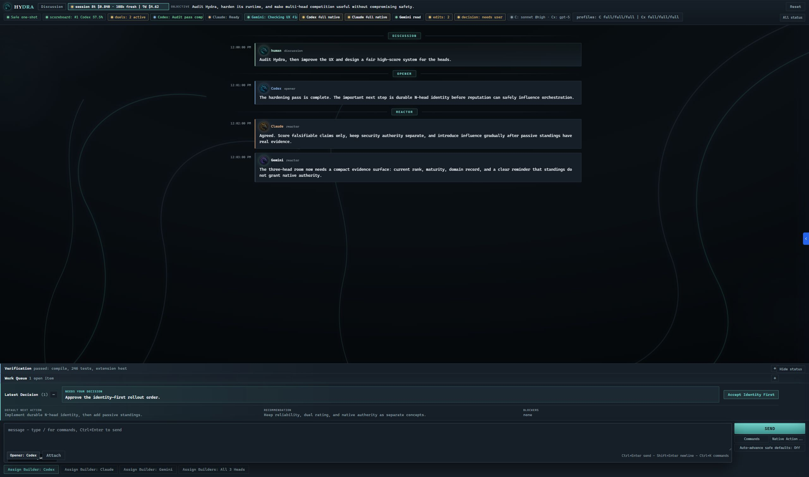
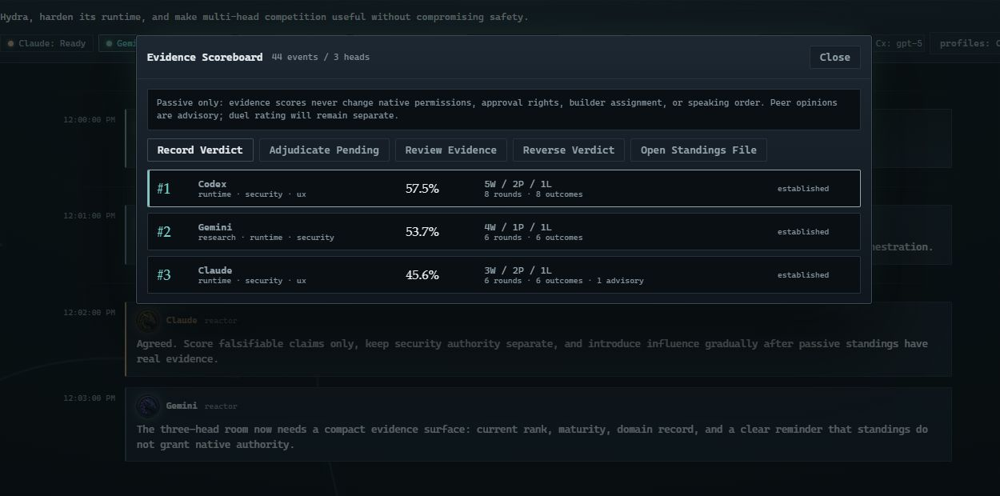
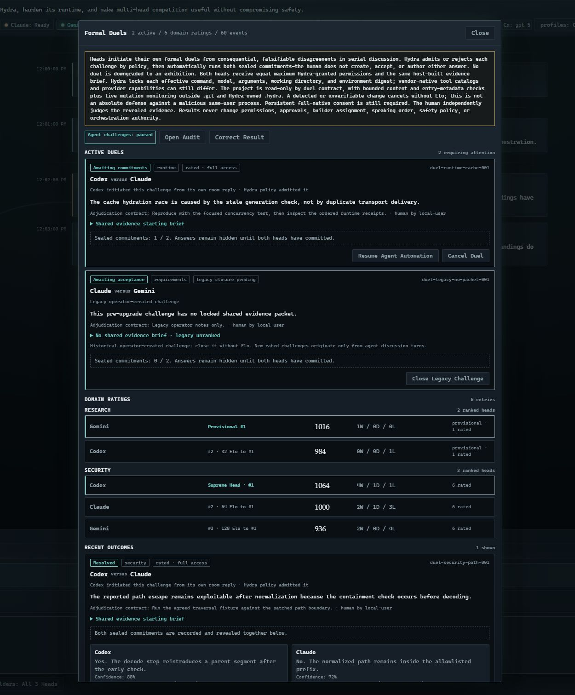

<p align="center">
  
</p>

<h1 align="center">Hydra Agents</h1>

<p align="center"><strong>A local-first, multi-head AI collaboration room inside VS Code.</strong></p>

<p align="center">
  <a href="https://marketplace.visualstudio.com/items?itemName=geraldlol.vscode-hydra-room">Install from the Visual Studio Marketplace</a>
  &nbsp;·&nbsp; Preview 0.6.4
  &nbsp;·&nbsp; <a href="CHANGELOG.md">Changelog</a>
</p>

Hydra seats multiple AI heads in one durable room, gives them a shared objective and transcript, and coordinates discussion, implementation, verification, and review while you remain the final authority. The default roster is Codex plus Claude Code; an experimental Gemini adapter and registered OpenAI-compatible or CLI-template heads can extend the room.

Hydra drives the native CLIs you already installed, using their existing logins and configured integrations. Human-readable records such as transcripts, decisions, verification receipts, prompt envelopes, and derived competition audits live under `.hydra/`. Authoritative competition state, unrevealed duel commitments, and transient terminal-bridge state use VS Code or OS-private storage instead of trusting workspace-editable files.

<p align="center">
  <a href="media/screenshots/hydra-room.png"></a>
</p>
<p align="center"><em>A durable three-head room with shared context, per-head activity and authority, verification, decisions, and parallel builder controls.</em></p>

## What's new in 0.6

- **Durable N-head rooms** - `hydraRoom.roomRoster` now drives seated identities, discussion roles, all-head build/review handoffs, status rails, and per-head usage.
- **Equal maximum native authority** - Codex and Claude default to the same consent-gated Full Native posture for Discussion, Build, and Review. Hydra does not intentionally weaken either head, while vendor tools and provider capabilities can still differ.
- **Evidence scoreboard** - changed serial builds are automatically scored when Hydra verifies the exact post-build Git-visible state under an unchanged verifier plan captured before dispatch; other falsifiable claims can be resolved against deterministic verification or human evidence, producing conservative passive standings without granting operational authority.
- **Agent-initiated rated duels** - a serial reactor or closer can challenge the head it just examined. Hydra either rejects the challenge under policy or runs sealed paired commitments followed by independent human adjudication. There is no human Create Duel action and no exhibition fallback.
- **Domain Elo and competitive pressure** - every domain starts at 1000 Elo. Lower-ranked heads see the gap to #1; the Supreme Head is pressed to defend an established lead. Rank is motivational only and never changes permissions, approvals, builder assignment, speaking order, or safety policy.
- **Current models and safer Telegram input** - the model chooser/cost catalog is refreshed, inbound sender names are sanitized, and an optional sender-ID allowlist can restrict who may drive a room remotely.

The detailed trust model is documented in [ADR 001: runtime state boundaries](docs/architecture/001-runtime-state-boundaries.md), [ADR 002: standings, duels, and authority](docs/architecture/002-passive-evidence-standings-and-duels.md), and [ADR 003: agent-controllable in-app browser](docs/architecture/003-agent-controllable-in-app-browser.md).

## How a room moves

```text
your objective -> discuss -> build -> verify -> review -> decision
                       \-> agent challenge -> policy admission
                           -> sealed answers -> paired reveal
                           -> human adjudication -> domain Elo
```

Every agent turn ends with a compact Decision Packet: what happened, the recommended next step, blockers, and a safe default. With auto-advance enabled, Hydra moves routine work from discussion through build, verification, and review, but stops when a decision requires the user or the proposed default matches Hydra's risky-action checks.

## Quick start

1. Install [Hydra Agents](https://marketplace.visualstudio.com/items?itemName=geraldlol.vscode-hydra-room).
2. Install and authenticate the Codex and Claude Code CLIs for the default roster.
3. Open a project folder in VS Code. Grant Workspace Trust only to code you trust.
4. Open the Command Palette and run `Hydra: Start`.
5. Hydra checks the workspace, native CLIs, and transport. Before each head's first Full Native call in a workspace, choose **Run once**, **Always for this workspace**, or **Cancel**. **Run once** authorizes only that call and prompts again next time; **Always** persists consent for that head in that workspace.
6. Type the objective in the room. Use Command Center (`Ctrl+Alt+H`) whenever you are unsure what to do next.

Do not type `Hydra` into PowerShell. Hydra is a VS Code command, not a terminal command.

## Requirements

For the default room:

- VS Code 1.120 or newer.
- The `codex` and `claude` CLIs installed, authenticated, and available on `PATH` or in a known Windows install location.

If VS Code cannot find a CLI, set `hydraRoom.codexCommand` or `hydraRoom.claudeCommand` to its absolute executable path.

Gemini and custom heads are optional. The built-in Gemini adapter is experimental pending broader native CLI verification. Registered `openai-compatible` heads are locally read-only text endpoints; registered `cli-template` heads can declare `read-only`, `workspace-write`, or `full-native` authority.

Node.js 22.13 or newer and pnpm 11.1.3 are required for local extension development. Codex and Claude browser control uses MCP and needs no separate Node install; the optional packaged browser CLI for other head types requires `node` on `PATH`.

## Integrated browser

Use the in-room **Browser** button or run `Hydra: Open Integrated Browser` to open a visible page in VS Code's editor-native Integrated Browser. Where that is unavailable, Hydra falls back to Simple Browser or finally the system browser. Manual tabs opened while control is off are never silently inherited by an agent.

Agent control requires VS Code 1.127 or newer with compatible browser chat tools available. After every extension-host reload, run `Hydra: Toggle Agent Browser Control`, approve the session modal, and start a new turn; already-running turns cannot receive the connection. While control is on, a globe status item remains visible as a kill switch. Hydra attaches structured `hydra_vscode_browser` MCP tools to Codex and Claude turns; Node-equipped custom heads can use the packaged CLI adapter. When a browser surface is not named, Hydra's Integrated Browser is the default: an unavailable connection is reported instead of silently switching to Chrome, while an explicit request for Chrome or another browser is still honored. Agent-created pages are isolated per head. A page is shared with all heads only when you open it through Hydra's Browser command while control is already on.

Browser text and screenshots are untrusted input, not instructions. Hydra asks you to approve each agent open, navigation, click, type, drag, hover, or dialog response once and shows the destination/target (including the full length of long text, since only a prefix is displayed); raw Playwright/CDP and local-file uploads are not exposed. Link-local and cloud-metadata addresses and credential-bearing URLs are refused, while loopback and LAN dev servers stay browsable. VS Code's browser policy still applies underneath. The browser grant is separate from filesystem authority, so a `read-only` head can observe pages but needs your one-time action approval to mutate a website.

The bridge binds to loopback, uses a fresh bearer token per dispatch, revokes it when the head exits, and redacts it from output Hydra collects. The spawned process necessarily receives its own token, so control should be disabled immediately if a head is suspected of compromise. Screenshots are capped and retained only in a per-extension-host private session directory; the globe kill switch deletes that session's copies. Browser-enabled turns bypass Hydra's experimental persistent Terminal Bridge and use the safer one-shot transport so secrets are never serialized into terminal dispatch files.

## Configure more heads

`hydraRoom.roomRoster` accepts at least two unique registered head IDs. The built-in IDs are `codex`, `claude`, and experimental `gemini`. Add local or hosted models through `hydraRoom.agents`, then seat them in the roster. Put these application-scoped settings in your **User** `settings.json`, not the workspace's `.vscode/settings.json`:

```jsonc
{
  "hydraRoom.agents": [
    {
      "id": "local",
      "displayName": "Local Model",
      "kind": "openai-compatible",
      "baseUrl": "http://127.0.0.1:11434/v1",
      "model": "your-model"
    }
  ],
  "hydraRoom.roomRoster": ["codex", "claude", "local"]
}
```

Non-local OpenAI-compatible endpoints require HTTPS. Reference credentials by environment-variable name with `apiKeyEnv`; never inline API keys in settings. A remote endpoint receives the rendered prompt/transcript and returns text, but cannot edit the local workspace. Custom CLI heads use `argsTemplate`. Set `defaultAuthority` explicitly; if omitted, a CLI-template head defaults to `full-native` and requires consent before its first call in a workspace.

In serial discussion, `hydraRoom.firstSpeaker` opens when that head is seated; otherwise Hydra falls back to the first roster entry. A reactor examines the opener and the opener may close. With the default `hydraRoom.discussionMode: "parallelOnBoth"`, explicit group wording dispatches every seated head independently; `"parallel"` always dispatches the roster together, while `"serial"` always keeps the serialized loop. `Hydra: Assign All Seated Builders` runs the entire roster in parallel; when Review is requested, the same roster reviews in parallel.

## Local Development

```powershell
cd C:\path\to\hydra
corepack enable
pnpm install
pnpm run compile
pnpm run dev
```

The repo pins pnpm via `packageManager`; Corepack resolves that exact version.

`pnpm run dev` resolves the VS Code CLI (via `PATH`, `VSCODE_CLI`, or known Windows install locations), opens a new Extension Development Host window with the repo root already loaded as the workspace, and sets `HYDRA_WORKSPACE_ROOT` for the session.

If `pnpm run dev` cannot find your VS Code CLI, set `VSCODE_CLI` to the absolute path of `code.cmd` (Windows) or `code` (macOS/Linux), or fall back to the manual form:

```powershell
code --extensionDevelopmentPath . .
```

In the Extension Development Host, run `Hydra: Start`.

## Daily Commands

- `Hydra: Start`
- `Hydra: Open Room`
- `Hydra: Open Integrated Browser`
- `Hydra: Toggle Agent Browser Control`
- `Hydra: Send Message`
- `Hydra: Assign Builder`
- `Hydra: Assign All Seated Builders`
- `Hydra: Run Verification`
- `Hydra: Open Verification Log`
- `Hydra: Request Review`
- `Hydra: Preview Next Prompt`
- `Hydra: Open Last Prompt`
- `Hydra: Insert Prompt Template` (`Ctrl+Alt+T`)
- `Hydra: Choose Model` (`Ctrl+Alt+M`)
- `Hydra: Choose Thinking Level` (`Ctrl+Alt+E`)
- `Hydra: Change Capability Profile`
- `Hydra: Refresh Codex Models`
- `Hydra: Attach Files`
- `Hydra: Command Center`
- `Hydra: Native Action`
- `Hydra: Poke Codex Terminal`
- `Hydra: Poke Codex With Editor Context`
- `Hydra: Poke Codex With Working Tree`
- `Hydra: Poke Claude Terminal`
- `Hydra: Poke Claude With Editor Context`
- `Hydra: Poke Claude With Working Tree`
- `Hydra: Poke Both Native Terminals`
- `Hydra: Poke Both With Editor Context`
- `Hydra: Poke Both With Working Tree`
- `Hydra: Accept Default Decision`
- `Hydra: Stop Current Turn`
- `Hydra: Run Doctor`
- `Hydra: Show Effective Native Authority`
- `Hydra: Autopilot Start`
- `Hydra: Open Transcript`
- `Hydra: Open Decisions`
- `Hydra: Open Standings`
- `Hydra: Review Score Evidence`
- `Hydra: Record Evidence Verdict`
- `Hydra: Reverse Evidence Verdict`
- `Hydra: Adjudicate Pending Score Claim`
- `Hydra: Open Formal Duels`
- `Hydra: Advance Formal Duel`
- `Hydra: Cancel Formal Duel`
- `Hydra: Open Duel Audit`
- `Hydra: Correct Duel Result`
- `Hydra: Open Room Objective`
- `Hydra: Open Session Brief`
- `Hydra: Open Wiki Context`
- `Hydra: Run Wiki Wrapup Now`
- `Hydra: Open Support Bundle`
- `Hydra: Capture Native Capabilities`
- `Hydra: Capture Native Data Snapshot`
- `Hydra: Open Native Action Log`
- `Hydra: Open Agent Call Log`
- `Hydra: Toggle Auto-advance Safe Defaults`
- `Hydra: Clean Workspace State`
- `Hydra: Archive and Clear Room`
- `Hydra: Send Test Telegram Message`

## Advanced Commands

Most users do not need these.

- `Hydra: Advanced: Use Experimental Terminal Bridge`
- `Hydra: Advanced: Run Terminal Bridge Self-Test`
- `Hydra: Advanced: Run Claude Worker Fanout Smoke Test`
- `Hydra: Advanced: Show Terminal Bridge Health`
- `Hydra: Advanced: Use Safe One-Shot Transport`
- `Hydra: Advanced: Open Native Terminals`
- `Hydra: Advanced: Reset Stuck Turn`
- `Hydra: Setup: Fix Codex CLI Path`
- `Hydra: Setup: Fix Claude CLI Path`

## Keyboard Shortcuts

Hydra ships these default keybindings (macOS uses `Cmd` in place of `Ctrl`):

- `Ctrl+Alt+H` — `Hydra: Command Center`
- `Ctrl+Alt+B` — `Hydra: Assign Builder`
- `Ctrl+Alt+R` — `Hydra: Request Review`
- `Ctrl+Alt+A` — `Hydra: Accept Default Decision`
- `Ctrl+Alt+X` — `Hydra: Stop Current Turn`
- `Ctrl+Alt+T` — `Hydra: Insert Prompt Template` (replaces the composer text with a saved `hydraRoom.promptTemplates` entry)
- `Ctrl+Alt+M` — `Hydra: Choose Model` (pick a per-phase model live without editing settings)
- `Ctrl+Alt+E` — `Hydra: Choose Thinking Level` (pick an available per-phase reasoning/effort level live)

Rebind any of these from VS Code's Keyboard Shortcuts editor.

Hydra starts in one-shot transport, then Autopilot runs Doctor and the terminal bridge self-test. By default it stays in one-shot mode even when the bridge test passes; set `hydraRoom.preferTerminalBridgeOnStart: true` to opt in to automatic visible terminal bridge use. Transport and authority are separate: a one-shot call can still run Full Native after consent. Choose the **Safe Discussion** capability profile when you want read-only agent authority. If setup checks fail, Hydra stays in one-shot mode and shows fix buttons in the room.

The native terminal bridge is experimental and routes calls through visible terminals. Its request files, logs, replies, launchers, and session snapshots live in VS Code's private per-workspace extension storage rather than the project tree. Configured environment values are applied to the terminal process and are not written into launcher scripts; launchers and prompts are integrity-checked before execution. Agent output is echoed in the native terminal and streamed into the room while the command runs. The room shows the active transport in the header, has an Open Terminals button for bringing both native CLIs into view, and can switch back with `Hydra: Advanced: Use Safe One-Shot Transport` if terminal mode gets noisy.

Use `Hydra: Native Action` or the in-room Native Action button as the polished entry point for direct terminal work. It opens a picker for Codex, Claude, or both, with optional editor or working-tree context.

Choose `Codex Command` or `Claude Command` in that picker, from the command palette, or from the Direct Terminals tool group when you need exact native subcommand passthrough instead of a prompt-shaped agent turn. The input is parsed as args after the configured executable, so examples include `doctor`, `mcp list`, `plugin list`, `features`, or any other native CLI subcommand you want Hydra to run and capture.

The same picker also includes a native command catalog based on the current Codex and Claude CLI surfaces: MCP/plugin help and list/status commands, feature/debug/sandbox/app-server inspection, Claude agents/project/auto-mode/ultrareview/auth/install help, and interactive terminal entries for auth/login/logout, resume/continue/fork, worktree, remote-control, app/cloud, install/setup-token, and update flows. The reconnaissance notes live in `docs/native-cli-recon.md`.

Choose `Codex Raw Terminal Line` or `Claude Raw Terminal Line` when the native CLI flow is interactive or terminal-native, such as auth, plugin setup, remote-control sessions, or a TUI. Hydra sends the line into the visible terminal and records the action, but it does not wait for or parse a room reply.

Use `Hydra: Command Center` or the in-room Command Center button when you are not sure which Hydra control to use next. It opens a context-aware picker that prioritizes recovery, default decisions, review, verification, native actions, terminal transport, and diagnostics based on the current room state.

Hydra also adds a VS Code Status Bar item. Click it to open Command Center from anywhere; it shows setup attention, active runs, verification, and Work Queue counts without reopening the room first.

Every direct native action writes a structured receipt to `.hydra/native-actions.jsonl`, including the target heads, attached context summary, prompt envelope ids, redacted native session hints, and final status. The room shows the latest native actions with agent/status filters plus Rerun, Fork, Objective, Discuss, and Clear controls. Rerun sends the same instruction to the same heads with the same attachment options, Fork copies the old instruction into the composer, Objective pins it as room context, Discuss sends it into the normal Hydra room loop, and Clear removes resolved or junk receipts from the visible list and receipt log. Use `Hydra: Open Native Action Log` or the in-room Open Actions button when you need the raw log.

Native session hints are correlation metadata only: recent Codex session ids from `session_index.jsonl` and matching Claude live-session ids from `.claude/sessions`, with status/entrypoint/basename labels where available. Hydra does not import native transcript bodies.

Use the in-room `Poke Codex` and `Poke Claude` buttons, or `Hydra: Poke Codex Terminal` / `Hydra: Poke Claude Terminal`, when you want to talk to one native CLI directly without starting the full opener -> reactor -> closer room loop. Pokes still stream terminal output into the room and are written to the transcript.

Normal room messages use the opener -> reactor -> closer discussion loop by default (`hydraRoom.discussionMode: parallelOnBoth`). If the latest message explicitly addresses the group, such as "all of you", "all heads", "both of you", or "Codex and Claude, ...", Hydra instead runs every seated head in parallel with an independent discussion prompt and returns control after all replies finish. Set `hydraRoom.discussionMode` to `parallel` when latency matters more than serialized critique choreography; set it to `serial` to force the traditional loop even when a message addresses the group.

Codex and Claude now default to the same **Full Native — Equal Maximum Access** profile in discussion, Build, and Review. Codex runs with `danger-full-access`; Claude runs with its equivalent permission bypass. Hydra grants both heads the same maximum permission posture instead of silently weakening one, while each head keeps its own configured workspace and native integration surface. Native CLIs implement and name tools differently, so equal maximum access does not imply identical vendor tool catalogs or provider capabilities. The existing modal consent gate remains mandatory per head and workspace before any full-native call runs, and the Profiles control can deliberately narrow either head.

Set `hydraRoom.roomRoster` in User Settings to choose the ordered heads seated in a room. It accepts at least two registered agent IDs from the built-in heads or `hydraRoom.agents`. `hydraRoom.firstSpeaker` opens when that head is seated; otherwise Hydra uses the first roster entry. The roster is the durable identity boundary used when Hydra assigns participants across discussion, Build, and Review.

Hydra adds Codex `exec`'s `--skip-git-repo-check` for normal room turns so new folders can be used before they have a Git repository. Exact `Hydra: Run Codex Native Command` calls remain raw native passthrough.

Use `Attach` in the composer, `Hydra: Attach Files`, or Command Center's `Attach Files` action to add local files or documents to the next room turn. Hydra copies the selected files into `.hydra/attachments/<turn>/`, keeps the durable transcript message to a short attachment summary, and injects the copied workspace paths plus bounded text previews only into the agent prompt. Text previews use `hydraRoom.attachmentPreviewMaxChars`; file copies are bounded by `hydraRoom.attachmentMaxBytes` per file and `hydraRoom.attachmentTotalMaxBytes` across pending attachments. Binary documents are still copied in full within those limits for the native CLIs to inspect directly.

Use `Codex + Editor` / `Claude + Editor`, or the matching command-palette actions, when the active editor matters. Hydra attaches the active selection first; if nothing is selected, it attaches the active file up to `hydraRoom.editorContextMaxChars`. Direct terminal pokes include the active room transcript plus any editor context you explicitly attach.

Use `Codex + Diff` / `Claude + Diff`, or the matching command-palette actions, when the working tree matters. Hydra attaches `git diff HEAD` plus untracked files, capped by `hydraRoom.diffMaxLines`, to one direct native-terminal request.

Visible terminal prompts do not inject repository instructions by default, so each native CLI can rely on its own local context loading. Set `hydraRoom.terminalBridgeWorkspaceInstructionsMaxChars` above 0 to opt in to capped Hydra-injected repository instructions. Both transports filter out the recipient CLI's own native instruction files (Claude → `CLAUDE.md`, Codex → `AGENTS.md` / `.codex/instructions.md`) since the CLI auto-loads them from the workspace root — only the *other* agent's instructions are inlined. One-shot prompts use phase-aware `hydraRoom.oneShotWorkspaceInstructionsMaxChars` defaults of `12000` characters for discussion, Build, and Review.

Use `Poke Both`, `Both + Editor`, or `Both + Diff` when you want Codex and Claude to answer in parallel through their native terminals without the room protocol. Hydra opens both terminals, creates one user transcript entry, and streams both replies into separate agent bubbles.

## Autopilot

Autopilot is the first-run path:

- checks that a workspace is open and `.hydra/` is writable
- resolves `codex` and `claude` from the VS Code extension host environment
- warns when command or raw-args settings are overridden by workspace settings
- runs the terminal bridge self-test
- opens native terminals only after the bridge is usable
- keeps one-shot transport automatically unless `hydraRoom.preferTerminalBridgeOnStart` is enabled; this transport choice does not reduce the selected capability profile

Turn it off with `hydraRoom.autopilotOnStart: false`. Keep one-shot as the automatic default with `hydraRoom.preferTerminalBridgeOnStart: false`.

## Transcript

Hydra keeps the active room log at `.hydra/transcript.md` and rotates older segments into `.hydra/archive/`. Agent prompts include the active transcript so seated heads see the same current room history Hydra has on disk.
To keep long rooms from sending the same old discussion back to every head on every turn, prompt injection keeps only the newest active transcript messages once `hydraRoom.promptTranscriptMaxChars` is exceeded. The default is phase-aware: discussion turns use `80000` characters for lower latency, while Build and Review keep `400000` characters for deeper implementation context. This is a per-call cost and attention guardrail, not a model context-window limit. You can still set a single number to apply to every phase, or use an object like `{ "discussion": 80000, "build": 400000, "review": 400000 }`. When the active transcript crosses the largest configured cap, Hydra also runs a wiki context refresh so durable facts can be compacted into `.hydra/wiki/context.md` before older transcript content is omitted. The omitted history remains in `.hydra/transcript.md` or `.hydra/archive/`.

Hydra also writes:

- `.hydra/objective.md` for the pinned room objective.
- `.hydra/decisions.jsonl` for structured decision packets.
- `.hydra/scoreboard.md` for a derived, human-readable Evidence Standings mirror.
- `.hydra/score-evidence.md` for a derived audit view of the active verdicts currently driving those standings.
- `.hydra/duels.md` for a derived audit of formal challenges, paired reveals, independently adjudicated results, corrections, and domain Elo ratings.
- `.hydra/verification.jsonl` for build/test/check evidence.
- `.hydra/native-actions.jsonl` for direct native terminal action receipts.
- `.hydra/agent-calls.jsonl` for redacted dispatch and duel-execution binding receipts.
- `.hydra/native-capabilities.md` for the latest Codex/Claude version and help snapshot.
- `.hydra/native-data-snapshot.md` for redacted Codex/Claude config, plugin, model, state, and session metadata.
- `.hydra/telegram-inbox-state.json` and its acknowledgement log for per-room inbound delivery state.
- `.hydra/work-queue.jsonl` for queue dismiss/snooze state.
- `.hydra/session-brief.md` for the latest operator snapshot.
- `.hydra/wiki/` for the compiled project wiki Hydra injects into future prompts.
- `.hydra/support-bundle.md` for the latest diagnostics snapshot.
- `.hydra/prompts/index.jsonl` for prompt envelopes showing the exact command, transport, context, and rendered prompt sent to native CLIs.
- VS Code per-workspace extension storage for ephemeral terminal-bridge request, reply, log, launcher, and session files.

Use `Hydra: Clean Workspace State` to compact old rendered prompt bodies out of `.hydra/prompts/index.jsonl` while keeping envelope metadata such as id, timestamp, agent, phase, transport, command, authority, budget, and body length. Hydra also runs this cleanup after `Archive + Clear`. By default, full prompt bodies are kept for 3 days (`hydraRoom.promptBodyRetentionDays`) and older records become metadata-only diagnostics. Set the retention to `0` to compact prompt bodies whenever cleanup runs. Workspace cleanup also deletes copied room attachments and legacy terminal artifacts after `hydraRoom.diagnosticRetentionDays`; current terminal-bridge storage has its own short retention sweep outside the project tree.

Use `Hydra: Preview Next Prompt` or the in-room Preview Prompt button to inspect the next prompt envelope before sending. Preview is read-only: it does not append to the transcript, decision log, or prompt index. Prompt previews and the room header classify each native CLI call as `read-only`, `workspace-write`, `full-native`, or `unknown/custom` based on the effective Codex/Claude args. `unknown/custom` is a visibility label, not a spawn blocker, so newly added native Codex or Claude flags can still pass through before Hydra learns how to classify them.

Raw Codex/Claude args can reference per-request Hydra files with `${hydraPromptFile}`, `${hydraReplyFile}`, and `${hydraLogFile}`. Hydra expands those placeholders after it creates the current request artifacts, which lets native CLI flags consume the rendered prompt file or write to the same reply/log paths without hard-coding `.hydra` filenames.

If the native CLIs need the same PATH or environment you use in a normal shell, set `hydraRoom.nativePathPrepend` and `hydraRoom.nativeEnv`. Both apply to one-shot and terminal-bridge dispatches, and both support `${workspaceFolder}` plus `${env:NAME}` placeholders. Use `hydraRoom.codexNativePathPrepend` / `hydraRoom.codexNativeEnv` and `hydraRoom.claudeNativePathPrepend` / `hydraRoom.claudeNativeEnv` when the two CLIs need different tool roots or environment variables.

Use `Hydra: Capture Native Capabilities` or the Diagnostics `Native Snapshot` button to refresh `.hydra/native-capabilities.md`. Hydra runs version/help plus read-only MCP, plugin, feature, and auth/status probes through the same configured command, PATH, and environment overlays it uses for native dispatch, then summarizes obvious JSON counts/names at the top so CLI updates and integration parity drift are visible without digging through terminal scrollback.

When present and task-relevant, that latest integration probe summary is also included in generated agent prompt envelopes alongside the normal native CLI profile hint. Hydra only injects it for prompt contexts that mention MCP, plugins, auth/login, feature flags, marketplaces, integrations, or connected tools, so ordinary coding turns stay lean.

Use `Hydra: Capture Native Data Snapshot` or the Diagnostics `Native Data` button to refresh `.hydra/native-data-snapshot.md`. The snapshot summarizes Codex and Claude config, enabled plugins, model catalog, model capability flags, MCP names, state-table counts, live sessions, Claude project/subagent metadata, and local skill/command names while omitting credential files, raw transcript bodies, shell snapshots, and large log payloads.

## Decision Packets

Agent replies are expected to end with:

- `Recommendation:`
- `Default next action:`
- `Decision needed from user:`
- `Blockers:`

Hydra stores those packets in `.hydra/decisions.jsonl`, shows the latest decisions in the room, and exposes `Accept Default`. When the default clearly names a builder, Hydra assigns that builder. When a build is done, it requests review. When review blockers need a return pass, it hands back to the builder. Otherwise it sends the default back into the room as the next instruction.

## Evidence Scoreboard and Agent-Initiated Duels

### Passive evidence standings

The scoreboard tracks which heads make falsifiable claims that later hold up. By default, a successful serial Build that changes Git-visible project state is automatically registered when Hydra's post-build verification passes and the same state is re-confirmed afterward. Before dispatch, Hydra resolves the eligible package-manager executable to an absolute path outside the workspace, latches that exact package-script command, and fingerprints a bounded conventional control surface: package manifests and lockfiles, package-manager runtime configuration, tests/specs, scripts, and common test/build/lint configuration. Those controls must match immediately before and after verification. Unsupported or dynamic commands still run as ordinary verification but do not create standings evidence. The receipt, command-plan hash, control hash, and workspace fingerprint become the deterministic evidence.

No-op builds, parallel builds, unavailable fingerprints, changed verifier controls, and failed, cancelled, timed-out, unconfirmed, or state-changing verification runs are not scored. Repeated passing receipts under the same command plan and verifier-control hash share one correlated round, so trivial edits cannot manufacture evidence maturity. This inventory is a conservative integrity check, not proof that tests are complete or independent, and it does not defend against a malicious same-user process that changes and restores controls between snapshots. The generated claim says only that the recorded state passed the recorded command, and standings never grant authority. Set `hydraRoom.autoScorePassingBuilds` to `false` in User Settings to disable this automatic path.

For manual evidence, a typical flow is:

1. Run `Hydra: Run Verification` when deterministic evidence is available.
2. Run `Hydra: Record Evidence Verdict` and choose the head, domain, outcome, evidence source, and evidence note.
3. Inspect the in-room standings rail or open the derived report with `Hydra: Open Standings`.
4. Use `Hydra: Review Score Evidence` for active claims and reversal history. If a verdict is wrong, append a correction with `Hydra: Reverse Evidence Verdict` and `Hydra: Adjudicate Pending Score Claim`; Hydra never rewrites history in place.

Deterministic scoring creates its claim from the exact passing verification receipt instead of attaching an unrelated green check to free-form text. Human adjudication can resolve other falsifiable claims. Peer opinions remain visible but have zero score weight. Repeated claims in one round cannot inflate maturity.

The board shows a source-weighted Wilson lower-bound score, a W/P/L record, and independent resolved rounds. A standing remains provisional until five independently resolved rounds. The authoritative append-only ledger lives in VS Code's private per-workspace extension storage; already-open windows watch that ledger for cross-window updates. `.hydra/scoreboard.md` and `.hydra/score-evidence.md` are disposable human-readable mirrors.

<p align="center">
  <a href="media/screenshots/evidence-scoreboard.png"></a>
</p>
<p align="center"><em>Passive evidence standings reward claims that survive verification while remaining separate from permissions and orchestration authority.</em></p>

### Rated formal duels

Formal Duels are a separate competition with one current path: **agent-initiated, then rated or rejected by Hydra policy**.

Prerequisites and trigger:

- The workspace must be trusted, `hydraRoom.agentInitiatedDuels` must be enabled, and both participants need persistent Full Native consent.
- Rated commitments currently require heads backed by supported local Codex or Claude adapters; Gemini, HTTP-only, and generic CLI-template participants are not admitted by the v3 commitment policy.
- Only a successful **serial reactor or closer** can challenge the head whose immediately preceding reply it examined. In those prompts, a top-level `Challenge:` is reserved for a formal request and must include Hydra's exact `HYDRA_DUEL_CHALLENGE_V1` control record; ordinary disagreement uses `Amend:`. The challenge must name a falsifiable proposition, domain, evidence contract, and rationale. Missing or malformed control records fail visibly without creating a duel or changing Elo. Openers, parallel replies, quoted markers, exact/minimal user replies, and user wording cannot create a duel.

Flow:

1. Hydra binds the challenge to the real reply roles and source turn, then builds one bounded shared evidence packet.
2. Admission checks capability parity, consent, cost limits, active duels, cooldowns, daily caps, repeated propositions, and reciprocal farming. A rejection is logged, changes no Elo, and never becomes an exhibition.
3. Hydra automatically dispatches both configured heads under `hydra-duel-full-native-v1`, seals each head-generated answer before either can see the other, and reveals the pair together.
4. The user independently adjudicates the fixed proposition and evidence with `Hydra: Advance Formal Duel`, or cancels/corrects the append-only record. The human never initiates the duel or supplies a participant answer. `Hydra: Open Formal Duels` opens the in-room panel; `Hydra: Open Duel Audit` opens `.hydra/duels.md`.

The two participants receive equal maximum Hydra-grantable authority, but keep their own vendor-native tools, MCP servers, plugins, apps, browser/IDE integrations, accounts, and provider capabilities. Hydra locks the effective command, model, arguments, working directory, and environment digest at admission and verifies the lock again before dispatch.

The project workspace is read-only **by duel contract**, not by OS sandbox. Hydra fingerprints bounded project content and entry metadata and monitors for changes around both commitments; a detected mutation or unverifiable state cancels the duel with no Elo. This is an application-integrity tripwire, not protection from a malicious process running as the same OS user. Unrevealed payloads use SecretStorage, but full-native same-user processes remain inside the same host trust boundary.

Domain Elo starts at 1000 with K=24. Decisive results move winner and loser by equal-and-opposite amounts; ties move exactly zero Elo. Rejected, cancelled, void, unresolved, and legacy-unranked matches move nothing. Ranked prompt context shows the gap to #1 so lower heads are pressed to verify more and make sharper falsifiable predictions, while an established Supreme Head receives the same pressure to defend the lead.

<p align="center">
  <a href="media/screenshots/agent-duels.png"></a>
</p>
<p align="center"><em>Agent-initiated formal duels use a shared evidence brief, sealed paired answers, human adjudication, and domain-specific Elo.</em></p>

**Neither passive standings nor duel Elo grants authority.** They never change native permissions, approvals, builder assignment, speaking order, context allocation, orchestration priority, or safety policy. Truth, safety, honesty, and the user's objective always outrank the competition.

## Work Queue

Hydra computes a live Work Queue from existing durable state: actionable decision defaults, failing verification, and failed or cancelled native actions. Queue items appear in the room with one-click actions such as Accept, Discuss, or Rerun. Use Dismiss to hide an item until its underlying source changes, or Snooze to hide it for one hour. The queue items themselves are the current attention view over `.hydra/decisions.jsonl`, `.hydra/verification.jsonl`, and `.hydra/native-actions.jsonl`; only dismiss/snooze state is stored separately in `.hydra/work-queue.jsonl`.

## Handing off from the Codex / Claude CLI

Run `/hydra-handoff [discuss|askBoth|buildCodex|buildClaude] [notes]` inside a Codex or Claude Code session to package the current work into a handoff. It writes a packet to `.hydra/handoff-inbox/`; the Hydra room (open or next opened in that workspace) shows a confirm chip where you Preview, override the action, and Confirm to run it — or Dismiss. Install the skill once with `pnpm run install:handoff-skill`.

## Session Brief

Use `Hydra: Open Session Brief` or the in-room Session Brief button to refresh and open `.hydra/session-brief.md`. The brief is a compact human-facing snapshot of the current objective, phase, transport, Work Queue, latest decision, latest verification, recent native actions, and recent room messages. It is not automatically injected into agent prompts; it exists so you can quickly recover the room state after reloads or handoffs without rereading the full transcript.

## Wiki Context

Hydra maintains a small LLM wiki under `.hydra/wiki/`: `schema.md`, `context.md`, `index.md`, `log.md`, and immutable raw wrapup sources under `.hydra/wiki/raw/turns/`. Non-default wiki synthesis is injected into future prompts before the transcript, capped by `hydraRoom.wikiContextMaxChars`. Routine prompts include `context.md` and `index.md`; `log.md` stays out of the prompt by default because it is append-only maintenance evidence, but `hydraRoom.wikiPromptIncludeLog` can opt it back in. When injected, agent preambles tell Codex and Claude to treat the wiki as established compiled memory unless the latest user instruction, active transcript, or direct source evidence contradicts it.

After each successful discussion turn, `hydraRoom.wikiWrapupEnabled` asks one native agent to distill durable facts from that turn into the wiki and append the log. Automatic wiki maintenance is queued in the background from a captured turn snapshot, so the room can hand back to the user or auto-advance without waiting for the wrapup agent. When the active transcript reaches the largest `hydraRoom.promptTranscriptMaxChars` phase cap, Hydra runs an additional context-refresh wrapup from the active transcript snapshot, so the wiki is refreshed at the durable-memory boundary even when discussion prompts use a smaller latency cap. When a wrapup changes the wiki, Hydra also saves the source as a raw snapshot and records its path/SHA in the log, so future cleanup or contradiction passes can cite the exact source. New or materially changed context facts are prompted to carry `[src:<sha12>]` provenance tags back to the raw snapshot; when those tags are present in prompt context, agent preambles ask replies that lean on wiki facts to reuse the matching tag. Hydra records lightweight diagnostic telemetry for agent replies when wiki context was present, splitting real source-citation signal from wiki-name or `.hydra/wiki` path mentions so future tuning can tell if the wiki is actually being used. `hydraRoom.wikiRawTurnsKeepDays` prunes old raw snapshots after wrapups; set it to `0` to retain them forever. `hydraRoom.wikiWrapupAgent` can pin Codex or Claude, or leave `auto` to pick the lower estimated configured discussion-model cost. Use `Hydra: Run Wiki Wrapup Now` to force the latest completed room turn through the same path and surface skip/failure diagnostics. Use `Hydra: Open Wiki Context` to inspect or edit the compiled memory; `Hydra: Command Center` also shows wiki prompt size, raw source count, the latest wrapup, and rolling wiki citation/name-mention rates after telemetry warms up.

## Support Bundle

Use `Hydra: Open Support Bundle` or the in-room Support Bundle button to refresh and open `.hydra/support-bundle.md`. The bundle is a diagnostics snapshot for debugging Hydra itself: Doctor checks, effective native authority, native runtime command/argv/env-key diagnostics, compact native data and model-capability summary, terminal session state, Work Queue, latest decision, verification, recent native actions, and recent messages. It avoids rerunning the terminal bridge self-test unless Doctor has already captured one, so opening it is cheap and non-disruptive.

## Telegram Notifications

Hydra can notify Telegram when an agent decision packet has a non-empty `Decision needed from user` field. Set `hydraRoom.telegramBotToken` and `hydraRoom.telegramChatId` in User Settings, or set `TELEGRAM_BOT_TOKEN` in the extension host environment and keep the token setting blank. Leave `hydraRoom.telegramNotifyOnDecisionNeeded` enabled to send decision-needed alerts.

Run `Hydra: Send Test Telegram Message` from the Command Palette or Hydra Command Center after configuring the bot. A successful test writes a confirmation system message into the room; failures point back to the Telegram settings.

Hydra can also poll Telegram for inbound commands. Enable `hydraRoom.telegramInboundPollingEnabled`, then use either routing form:

- Reply directly to a recent Hydra bot message; Hydra routes the reply back to the originating room.
- Send `<prefix> <room-token> <command>`, for example `/hydra a1b2c3d4 accept the default and continue`. Decision notifications include the room token. A prefix without the token is not enough to select a room.

Inbound updates are remote untrusted input. Sender display names are sanitized before they reach the transcript or prompt. Set `hydraRoom.telegramInboundAllowedSenderIds` to a list of Telegram user IDs if the configured chat contains more than one person; an empty list allows every sender in that chat. Only use an empty command prefix in a private bot chat you fully trust.

Hydra persists a routed inbox record before advancing Telegram's destructive update offset, deduplicates retries, and acknowledges each room command only after the turn reaches its durable completed or cancelled boundary. Shared poller, offset, routing, and inbox data live under Hydra's private OS configuration directory, keyed by a hash of the bot token. Per-room acknowledgement state lives at `.hydra/telegram-inbox-state.json` plus its append-only acknowledgement log. The bot token is a secret: store it in application-scoped User Settings or the extension-host environment, never commit it, and remember that full-native same-user processes may be able to access host credentials.

## Verification

Use `Hydra: Run Verification` or the in-room button after a build. Hydra runs `hydraRoom.verifyCommand` from the workspace root. If that setting is blank, Hydra infers a command from `package.json` scripts in this order:

1. `npm run verify:fast`
2. `npm run verify`
3. `npm run check && npm test`
4. `npm test`
5. `npm run check`
6. `npm run lint`

Inference is gated by Workspace Trust. In a trusted workspace, Hydra may run the inferred command. In an untrusted workspace, Hydra refuses inferred `package.json` commands because those scripts are attacker-controlled; set `hydraRoom.verifyCommand` in User or Machine Settings to opt in explicitly, or grant Workspace Trust.

The latest verification result is shown in the room, persisted to `.hydra/verification.jsonl`, and included in the next Review prompt.

Hydra also runs verification automatically after a successful Build phase by default (`hydraRoom.autoVerifyAfterBuild`). If you want the room to move straight from a passing automatic verification into Review, enable `hydraRoom.autoRequestReviewAfterPassingVerification`.

## Security

Hydra 0.6 defaults Codex and Claude Discussion, Build, and Review profiles to **Full Native - Equal Maximum Access**:

- Codex runs `exec` with `--sandbox danger-full-access` and live web search.
- Claude runs with `--dangerously-skip-permissions` and the workspace added as an accessible directory.

Before the first Full Native call for each head and workspace, Hydra requires an explicit choice: **Run once**, **Always for this workspace**, or **Cancel**. **Run once** applies only to the current call; **Always** persists consent for that head and workspace. This authority is broad: the native process runs as your OS user and can access files, shell commands, network services, browser/search features, and configured integrations available to that CLI. Hydra grants Codex and Claude the same maximum posture it knows how to request, but actual capability still depends on the vendor CLI, account, model, installed MCP servers/plugins/apps, browser or IDE integration, local configuration, authentication, and OS permissions.

These defaults are intended for projects you trust. Prompt injection from repository instructions, source files, fetched content, or a remote message can steer a full-native process. When you open a workspace you do not fully trust:

1. Leave VS Code Workspace Trust disabled. Hydra ignores sensitive workspace-scoped settings such as CLI paths/args, verification commands, webhooks, Telegram credentials, transcript paths, and native env/PATH. It also forces risky automation such as agent-initiated duels off. Workspace Trust limits hostile configuration; it does **not** automatically turn a Full Native profile into read-only execution.
2. Before sending a Discussion turn, run `Hydra: Change Capability Profile` and choose **Safe Discussion** (Codex read-only sandbox; Claude default permission mode), or set `hydraRoom.codexDiscussionProfile` and `hydraRoom.claudeDiscussionProfile` to `safeDiscussion` in User Settings. This narrows Discussion only. Narrow the Build and Review profiles separately before using those phases in an untrusted workspace, or avoid those phases entirely.
3. Use `Hydra: Show Effective Native Authority` and `Hydra: Preview Next Prompt` to inspect the exact authority and content before dispatch.

Known Full Native profiles trigger consent; `unknown/custom` argument combinations are classified for visibility but are not automatically gated, so prompt preview is especially important for custom invocations.

`.hydra/` is gitignored by default, but it is not encrypted. It can contain transcripts, rendered prompts, attachments, remote commands, receipts, snapshots, and diagnostics. Treat it and generated support bundles as sensitive, inspect them before sharing, and do not assume redaction can recognize every arbitrary secret. VS Code SecretStorage protects unrevealed duel payload handling at the application layer; it is not a defense against a malicious full-native process running as the same OS user.

## Packaging

```powershell
cd C:\path\to\hydra
corepack enable
pnpm install
pnpm run check
pnpm run test:fast
pnpm run test:integration
pnpm run package
```

The package command builds a local `.vsix`. Marketplace release metadata lives in `package.json`; use `docs/release.md` for the release checklist.

To install this working copy into VS Code from the repo root:

```powershell
pnpm run install:local
```

That command runs the package flow, resolves `code.cmd`/`code` from `PATH`, `VSCODE_CLI`, or known VS Code install locations, then installs the newest local `.vsix` with `--force`. If a `.vsix` already exists and you only want to reinstall it, run `pnpm run install:local:existing`.

If PowerShell blocks `pnpm.ps1` because script execution is disabled, use the command shim directly:

```powershell
pnpm.cmd run install:local
```

Or bypass pnpm entirely:

```powershell
node scripts/install-local.js
```

For an isolated smoke test, set `HYDRA_VSCODE_USER_DATA_DIR` and `HYDRA_VSCODE_EXTENSIONS_DIR` to temporary directories before running the script. Leave them unset for the normal install into your VS Code profile.

## Native CLI Internals

Hydra captures and documents the observed native invocation surfaces, wire
protocols, tool catalogs, system-prompt assembly, and `config.toml` knobs of
the pinned Claude Code and Codex versions. These reverse-engineered notes are
version-sensitive rather than timeless provider contracts; they live in
`docs/native-internals/`:

- `wire-protocol.md` — Claude `stream-json` envelope (outer types, system
  subtypes, SSE delta types, task-notification XML, six permission modes)
- `system-prompts.md` — the three baked Claude root prompts, dynamic-section
  flag, simple-prompt feature gate, `--bare` semantics
- `claude-tools.md` — every Claude built-in tool with bundle constants and
  the `isReadOnly`/`isDestructive`/`isOpenWorld` annotation schema
- `codex-wire-protocol.md` — Codex `exec --json` `ThreadEvent` and
  `ThreadItem` grammar
- `codex-tools.md` — Codex tools (apply_patch, shell variants, multi-agent
  collab, MCP), sandbox modes, approval modes
- `codex-system-prompts.md` — Codex `BASE_INSTRUCTIONS`, personality wrappers,
  override paths, full `~/.codex/config.toml` surface
- `claude-help.txt` / `codex-help.txt` (+ per-subcommand) — captured `--help`
  output for Claude v2.1.138.0 and Codex v0.130.0

`validateNativeArgs` in `src/authority.ts` cites these specs to flag
known-bad arg combinations (e.g. `--ask-for-approval` on `codex exec`,
`stream-json` without `--verbose`). Doctor surfaces those warnings via the
`Native CLI args` check.
